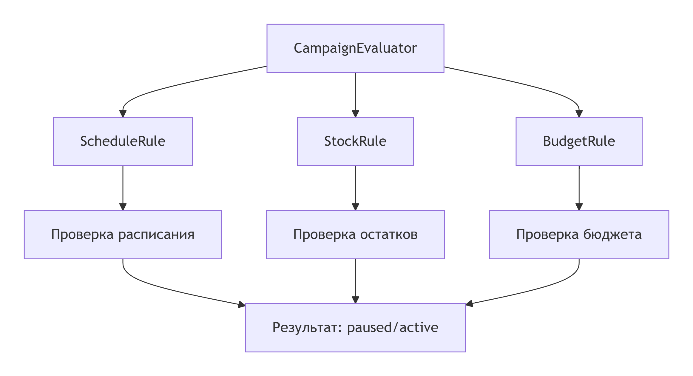
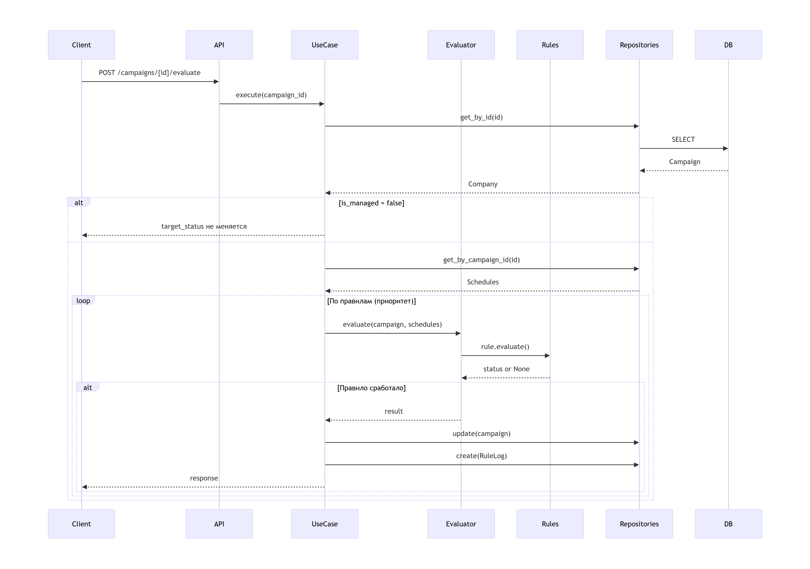

Для запуска проекта:
1.Перейдите в корневую папку проекта
2.Создайте виртуальное окружение: python -m venv .venv
3.Активируйте его : .venv\Scripts\activate
4.Установите зависимости: pip install -r requirements.txt
Запуск docker-compose: 
1.Из корневой директории выполните команду: docker compose up
Запуск моделей миграций
1.Запустить миграцию: alembic upgrade 0e16fb15beb7_rulelog
2.Запуск проекта: python main.py

Для запуска тестов:
1.Убедитесь что проект запущен, также убедитесь что в таблицах есть не обходимые данные для тестов
2 Перейдите в директорию test
3.Запустите

Ключевые компоненты
1. Domain Layer (Бизнес-сущности)
text
domain/
├── entities/
│   ├── company_ent.py      # Кампания (Company)
│   └── shedule_ent.py      # Расписание (Shedule)
└── repositories/
    ├── icompany_crud.py    # Интерфейс репозитория кампаний
    └── ischedule_crud.py   # Интерфейс репозитория расписания
2. Application Layer (Бизнес-логика)
text
application/
└── evaluate.py             # Движок правил
Структура движка:

Последовательность работы
